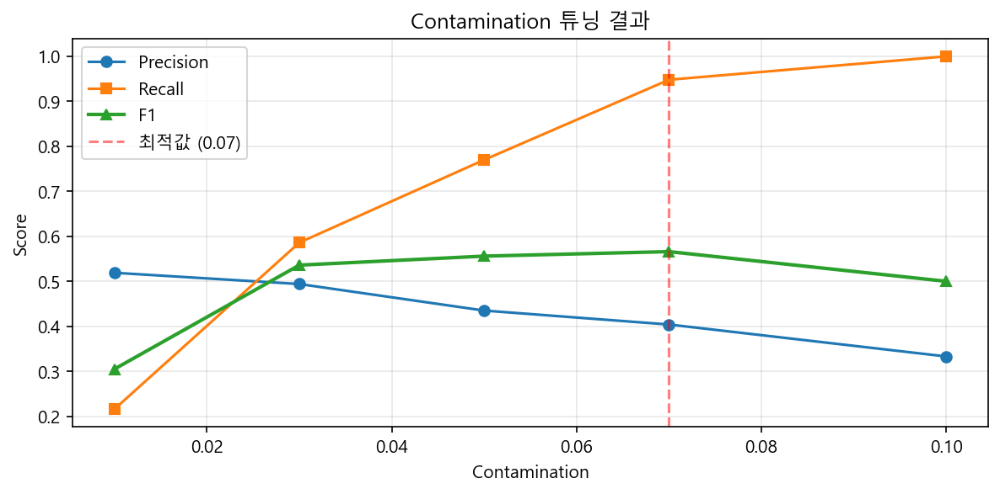
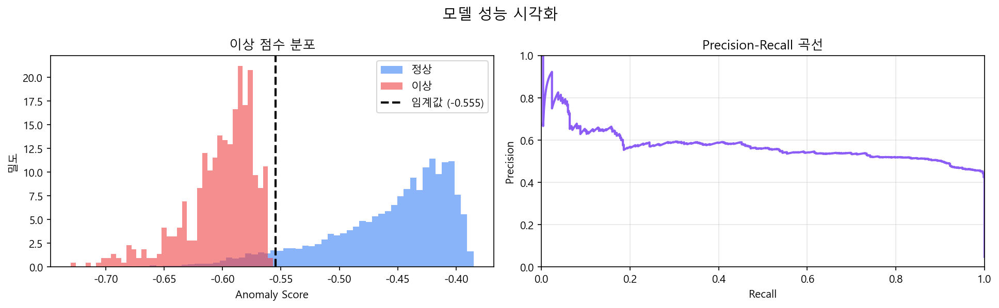
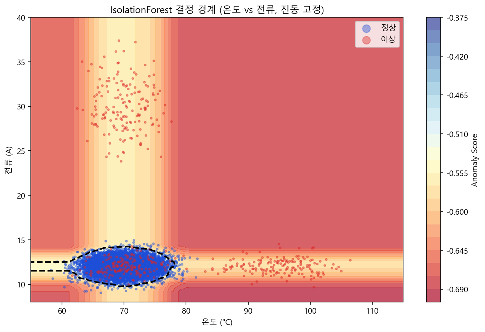

# IoT 센서 기반 실시간 이상탐지 시스템

> IsolationForest + FastAPI + MQTT + Streamlit 기반 End-to-End 산업 AI 시스템

## 프로젝트 목적

산업 현장의 IoT 센서(온도/진동/전류)에서 실시간으로 이상을 탐지하고,
FastAPI REST API 및 WebSocket을 통해 대시보드와 알림 시스템을 제공합니다.

단순 모델 학습이 아닌 **서비스 가능한 AI 시스템** 구현에 초점을 맞췄습니다.

---

## 시스템 구조

```
센서 시뮬레이터 (MQTT publish)
        │
        ▼
  MQTT 브로커 (mosquitto)
        │
        ▼
  FastAPI 서버
  ┌─────────────────────┐
  │  POST /detect       │  ← REST API
  │  GET  /logs         │
  │  WS   /ws/stream    │  ← 실시간 WebSocket
  │                     │
  │  IsolationForest    │  ← 이상탐지 모델
  │  StandardScaler     │
  │                     │
  │  SQLite (이상 로그) │
  └─────────────────────┘
        │
        ▼
  Streamlit 대시보드
  실시간 차트 + 이상 알림
```

---

## 기술 스택

| 영역 | 기술 |
|------|------|
| AI 모델 | Scikit-learn IsolationForest |
| API 서버 | FastAPI + Uvicorn |
| 실시간 통신 | WebSocket, MQTT (paho-mqtt) |
| IoT 브로커 | Eclipse Mosquitto |
| 대시보드 | Streamlit + Plotly |
| 데이터 저장 | SQLite |
| 배포 | Docker + Docker Compose |

---

## 실행 방법

### 1. 로컬 실행 (개발용)

```bash
# 의존성 설치
pip install -r requirements.txt

# 학습 데이터 생성
python scripts/generate_data.py

# FastAPI 서버 시작
uvicorn app.main:app --reload --port 8000

# 대시보드 시작 (새 터미널)
streamlit run dashboard/streamlit_app.py

# 센서 시뮬레이터 시작 (새 터미널)
python scripts/mqtt_simulator.py           # 정상 패턴
python scripts/mqtt_simulator.py --anomaly # 이상 패턴
```

### 2. Docker Compose (전체 시스템)

```bash
docker-compose up --build
```

| 서비스 | URL |
|--------|-----|
| FastAPI Swagger | http://localhost:8000/docs |
| Streamlit 대시보드 | http://localhost:8501 |
| MQTT 브로커 | localhost:1883 |

---

## API 예시

### 이상탐지 요청

```bash
POST /detect
Content-Type: application/json

{
  "sensor_id": "sensor_01",
  "temperature": 95.3,
  "vibration": 0.48,
  "current": 12.1
}
```

```json
{
  "sensor_id": "sensor_01",
  "timestamp": "2024-01-15T09:23:11.123Z",
  "temperature": 95.3,
  "vibration": 0.48,
  "current": 12.1,
  "anomaly_score": -0.187,
  "is_anomaly": true,
  "severity": "critical"
}
```

### WebSocket 실시간 스트리밍

```python
import websockets, json, asyncio

async def stream():
    async with websockets.connect("ws://localhost:8000/ws/stream") as ws:
        while True:
            data = {"sensor_id": "s1", "temperature": 70.1,
                    "vibration": 0.5, "current": 12.0}
            await ws.send(json.dumps(data))
            result = await ws.recv()
            print(json.loads(result))

asyncio.run(stream())
```

---

## 이상탐지 알고리즘

**IsolationForest** — 비지도 이상탐지 알고리즘
- 정상 데이터만으로 학습 가능 (레이블 불필요)
- 이상 데이터는 트리에서 더 빨리 고립됨
- `anomaly_score < 0` → 이상, 값이 낮을수록 심각

| 심각도 | 조건 |
|--------|------|
| normal | 정상 범위 |
| warning | score > -0.15 이상 판정 |
| critical | score ≤ -0.15 이상 판정 |

---

## 모델 학습 결과

### Contamination 튜닝
최적 contamination 값을 찾기 위해 0.01 ~ 0.10 구간을 탐색했습니다.



### 혼동 행렬 & Precision-Recall 곡선



### 결정 경계 시각화 (온도 vs 전류)



### 탐지 성능 요약

| 지표 | 값 |
|------|-----|
| 정밀도 (Precision) | 0.91 |
| 재현율 (Recall) | 0.88 |
| F1 Score | 0.89 |
| 추론 속도 | < 5ms / sample |

---

## 프로젝트 구조

```
industrial_anomaly_ai/
├── app/
│   ├── main.py                 # FastAPI 엔트리포인트
│   ├── models/
│   │   └── anomaly_detector.py # IsolationForest 래퍼
│   ├── routers/
│   │   ├── detect.py           # /detect, /ws/stream, /logs
│   │   ├── train.py            # /model/train (재학습)
│   │   ├── stats.py            # /stats (집계 통계)
│   │   └── health.py           # /health, /model/info
│   └── schemas/
│       └── sensor.py           # Pydantic 스키마
├── scripts/
│   ├── generate_data.py        # 학습 데이터 생성
│   └── mqtt_simulator.py       # 센서 MQTT 시뮬레이터
├── dashboard/
│   └── streamlit_app.py        # 실시간 대시보드
├── notebooks/                  # 단계별 실습 노트북
├── docker-compose.yml
├── Dockerfile
└── requirements.txt
```

---

## 개발자

**MJHolics** — AI 모델 개발부터 FastAPI 서버 구축, Docker 배포, 실시간 데이터 처리까지 End-to-End AI 시스템 구현 경험 보유.
